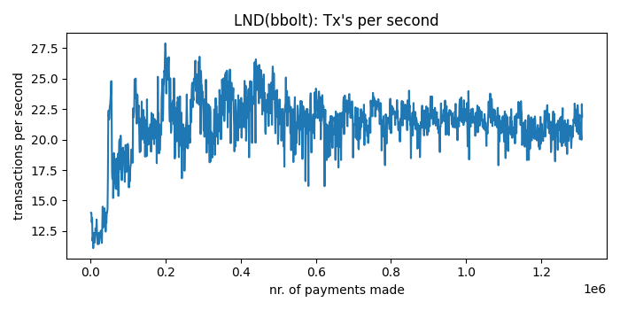

# Lightning benchmark

Recently, the [podcasting 2.0 movement](https://blog.getalby.com/bitcoin-payments-for-podcasters-with-alby/) is taking off in a big way. V4V payment "streaming" through keysend probably accounts for a big chunk of all Lightning transactions today, and soon it will probably by far be the majority of LN volume. In his [2021 blog post](https://bottlepay.com/blog/bitcoin-lightning-node-performance/), Joost Jager of Bottlepay benchmarked multiple Lightning implementations to see how they would behave under high load. In his blog post, he mentions:

|To give an example: a weekly podcast is listened to by 500,000 people. These people stream sats by the minute. The podcast length is 50 minutes. This makes the total number of payments for one episode 25 million. There are roughly 600,000 seconds in a week. If the listening is completely evenly distributed throughout the week, this would work out to ~40 transactions per second. In reality, the peak load right after the release of the episode is much higher. And this is just the figure for a single podcast.

In fact Joost had forgotten about the splits: v4v streams can be split up between different recipients (the host, the guest, the producer, the hosting provider, etc.). So the actual load can be between 5 and 10 times more! 

Clearly, these numbers are insane, and I do feel that more batching of payments at the client level will be required in the future. However, we found it would be interesting to try and re-do the load test using the infrastructure that we currently use at Alby, to gain some insights in how different implementations would fare under an extremely high load. Here we present our findings.

We only tested keysend payments because that's what's used by the podcasting 2.0 specification. We haven't changed much configuration from the default, except for changing Eclair's `eclair.channel.max-accepted-htlcs=483`, because the default of this value on Eclair is lower than the default on LND, and this would have an impact on the test results.

# Instance specifications
Backend infrastructure at Alby is run on Digital Ocean Kubernetes on relatively modest hardware. So it made sense to use the same machines to run the load test. Ofcourse this means that we probably won't be able to reproduce the same results that Joost got when running the benchmark on more powerful VM's.

For the node itself, we run on DO's `s-2vcpu-4gb` instance but since it's run in a K8S cluster, there is only about 2.5GB memory available, which is why we put a 2GB memory limit on the pod's resources.
In the case we use a PG database, it is also on a `db-s-2vcpu-4gb` node. 

# The load tester
For testing, we used the same [Go application](https://github.com/getAlby/lightning-benchmark/tree/master/loadtest) that was used in Bottlepay's load test 2 years ago. We always open 10 channels of 10M sats each between the nodes, and always send a single satoshi per payment. 
# LND + BBolt DB
We map the throughput (transactions per second) and the average latency as a function of the nr. of payments processed in the run.

